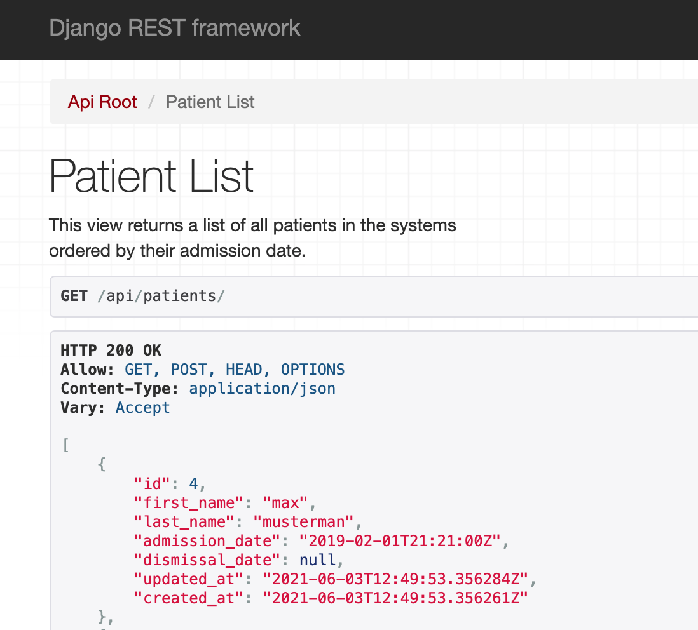
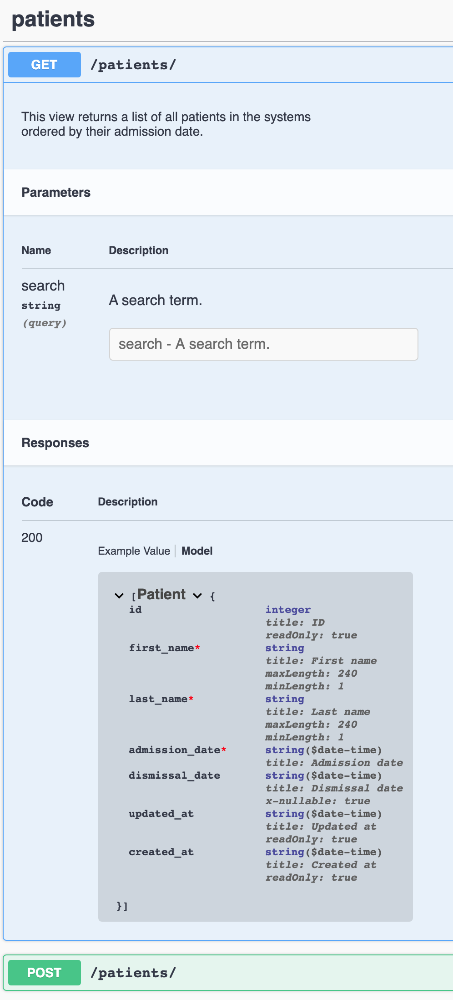

# New REST API Endpoint

In this tutorial we create a new REST API endpoint.

## Model

First we have to create a model. In this example a simple patient model.

```python
from django.db import models

class Patient(models.Model):
    """
    Patient instance.
    """
    first_name = models.CharField(max_length=240)
    last_name = models.CharField(max_length=240)
    admission_date = models.DateTimeField()
    dismissal_date = models.DateTimeField(blank=True, null=True)
    created_at = models.DateTimeField(auto_now_add=True)
    updated_at = models.DateTimeField(auto_now=True)
    
```

**file:** ``dashboard/patients/models.py``

## Serializer
The second step is to serialize the model. To do so, we import the serializer from the [Django Rest Framework](https://www.django-rest-framework.org/)
and create a new Serializer Class, that inherits from the ModelSerializer. The base model for this serializer is the just created patient model.
In the ``fields`` argument we may list all the fields we want to serialize. It is also possible to define ``__all__`` or exclude certain fields.


```python

from rest_framework import serializers
from dashboard.patients.models import Patient

class PatientSerializer(serializers.ModelSerializer):
    class Meta:
        model = Patient
        fields = ["id", "first_name", "last_name", "admission_date",
                  "dismissal_date", "updated_at", "created_at"]

```

**file:** ``dashboard/patients/api/serializers.py``

## View
To be able to see the serialized data, search through it and refer to the endpoint via a link, a view needs to be set up.
A fairly minimalistic setup looks something like this. The ``ModelViewSet`` is imported from the Django Rest Framework and the Base
for the ViewSet. The serializer is the one we just created and the queryset may be more simple but in this way shows the possibility to create more
custom functions to define the queryset.

An alternative to the queryset definition below would be to write ``queryset = Patient.objects.all().order_by('-admission_date')``
right beneath the ``serializer_class`` and leaving out the method ``get_queryset``.
````python

from rest_framework.viewsets import ModelViewSet
from dashboard.patients.api.serializers import PatientSerializer
from dashboard.patients.models import Patient

class PatientViewSet(ModelViewSet):
    """
    This view returns a list of all patients in the systems
    ordered by their admission date.
    """
    serializer_class = PatientSerializer

    def get_queryset(self):
        queryset = Patient.objects.all()
        queryset = queryset.order_by('-admission_date')
        return queryset


````

**file:** ``dashboard/patients/api/views.py``

!!! info

    If you take a look at the Definition of ``ModelViewSet``:


        class ModelViewSet(mixins.CreateModelMixin,
                       mixins.RetrieveModelMixin,
                       mixins.UpdateModelMixin,
                       mixins.DestroyModelMixin,
                       mixins.ListModelMixin,
                       GenericViewSet):
        """
        A viewset that provides default `create()`, `retrieve()`, `update()`,
        `partial_update()`, `destroy()` and `list()` actions.
        """

    You can see, that it provides create, retrieve, update, delete and list functions, just as you would expect a REST API
    to. If you prefer a more specific definition, e.g. an endpoint with just the list action, you may wanna consider to 
    only use the ``ListModelMixin`` instead of the ``ModelViewSet``.


## URLs
Finally, we have to define a route for the api. The string we define here will be the string that follows the ``/api/``. 
So in this case, our new route, that is connected to the PatientViewSet that we created in the previous step is ``www.example.com/api/patients/``

```python

from django.urls import path, include
from rest_framework.routers import DefaultRouter

from dashboard.patients.api.views import PatientViewSet

router = DefaultRouter()
router.register(r"patients", PatientViewSet, basename="patients")

urlpatterns = [
    path("", include(router.urls)),
]

```

**file:** ``dashboard/patients/api/urls.py``

## Results

### Browsable API

``/api/patients/``

At the ``/api`` endpoint you can find the Browsable API with all exposed endpoints. The data of our newly created endpoint can be 
seen at ``/api/patients/`` and will show a list of all the instances of a patient model with all the fields defined in the serializer.



### Swagger API Documentation

``/swagger``

The Swagger API Documentation also shows all the currently available endpoints, but focuses more on the specification of the 
endpoints rather than on the data itself. However, the saved instances of a model can be obtained through the interactive mode of swagger, where
you can request data from any endpoint or even post data to an endpoint. 

