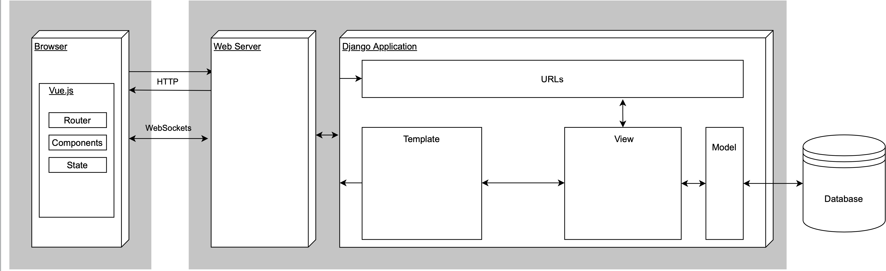

# Basics

This section covers the overall basics of the project regarding the back end (Django) and the front end (Vue.js).
The most important aspects to get started will be covered.

## System overview

A brief overview over the system can be obtained from the following diagram:

## Main functionality

For this application, the most important functions the back end and the front end have to provide are as follows:

=== "Back end"

    - Managing models and persist data in a database
    - Handling the database connection
    - Providing a a REST API
    - Providing a WebSocket
    - Handling WebSocket connections
    - Managing users, authentication and sessions

=== "Front End"

    - Provide a user interface to interact with the database's data
    - Management and visualization of vital data/patient's report data
    - Basic management of patients
    - Real-time updates without user interaction (WebSockets/Reactivity)
    - Display notifications (received from the back end)

### WebSockets / Real-time communication

**The front end of this application works with data provided through WebSockets**. WebSockets allow for full-duplex communication, meaning
    that both, the back end and the front end can send each other messages whenever they need to. Without the other one
    asking for it. This enables a real-time behaviour in the front end and works well together with the reactivity of 
    Vue.js. Real-time communication and especially real-time updates can on the one hand be useful for tele-consultation, where all clients
always have the same most recent data available on screen whithout the need to refresh manually. On the other hand the WebSockets enable
the server to send notifications whenever it's needed and the client to receive them in time.
    

However there is some data, that doesn't need to be transferred via WebSockets, like the authentication data.
    This data is handled using HTTP REST on both sides. Additionally, some other apps that will be integrated in the future might require
    normal REST API endpoints, which is why this project is structured to build the WebSockets endpoint on top of REST API endpoints, 
so that there are always both options. The following diagram illustrates the usage of HTTP and WebSockets:

