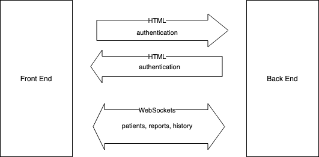

### Model-View-Template (MVT)

Django is following the Model-View-Template structure, where the Model is for structuring and manipulating the data of the application, the view implements
the business logic and the templates serves the views to the clients. In this project, the templates are rendering the static files
provided by the webpack bundling, that are moved into the ``static`` folder inside the back end directory after executing ``npm run build`` inside the ``vue_frontend`` directory.

The principle of Django's MVT architecture is visualized in the following diagram:

<br>
<small>Source: https://www.javatpoint.com/django/images/django-mvt-based-control-flow.png</small>


#### Model

The model of the application is to be found in the respective ``models.py`` file. See [https://docs.djangoproject.com/en/3.2/topics/db/models](https://docs.djangoproject.com/en/3.2/topics/db/models) for documentation on how to create Models and available Fields.
All of the data of the model instances are saved to a **PostgreSQL** Database. Postgres integrates well with Django and Django even supports some fields exclusively for Postgres. See [https://docs.djangoproject.com/en/3.2/ref/contrib/postgres/](https://docs.djangoproject.com/en/3.2/ref/contrib/postgres/)

#### View

The view implements the business logic of the application. In the ``patients/api/views.py``, the REST API endpoints are defined. The most important endpoints that are exposed
as of the end of the thesis are:

| Endpoint           | Actions (REST)                 | Description                      |
|--------------------|-------------------------|----------------------------------|
| ``/api/patients/``     | GET, POST               | List view of all patients        |
| ``/api/patients/id/``  | GET, PUT, PATCH, DELETE | Detail view of a single patient  |
| ``/api/reports/``      | GET, POST               | List view of all reports         |
| ``/api/reports/id/``   | GET, PUT, PATCH, DELETE | Detail view of a single report   |
| ``/rest-auth/login/``  | POST                    | Login with username and password |
| ``/rest-auth/logout/`` | POST                    | Logout and delete token          |
| ``/rest-auth/user/``   | GET                     | Retrieve user information        |


A full documentation of all available endpoints as well as an **interactive demo** of the endpoints can be obtained from the 
endpoint ``/swagger``. Curl commands can be interactively executed on the page and requests and responses can be analysed.

The fields, that are to be included (or excluded) in the respective JSON responses are defined in the ``patients/api/serializers.py`` file.

!!! attention

    **The front end of this application works with data provided through WebSockets**. The aforementioned REST API
    endpoints are delivered via HTTP and useful for the integration of other services. The communication between the 
    back end and the front end is mostly based on WebSockets however. WebSockets allow for full-duplex communication, meaning
    that both, the back end and the front end can send each other messages whenever they need to. Without the other one
    asking for it. This enables a real-time behaviour in the front end and works well together with the reactivity of 
    Vue.js. 

    However there is some data, that doesn't need to be transferred via WebSockets, like the authentication data.
    This data is handled using HTTP REST on both sides. The following diagram illustrates the usage of HTTP and WebSockets:

    


With the WebSocket integration, the endpoints for WebSocket requests are defined like so:


| Stream   | Consumer        | Model            | Actions (REST-like)                                      |
|----------|-----------------|------------------|-----------------------------------------------|
| ``patients`` | PatientConsumer | Patient          | List, Retrieve, Create, Patch, Update, Delete |
| ``reports``  | ReportConsumer  | Report           | List, Retrieve, Create, Patch, Update, Delete |
| ``history``  | HistoryConsumer | HistoricalReport | List, Retrieve, Patch, Update, Delete         |


The endpoints are defined in the ``asgi.py`` file of the Project. For more information see [**Routing**](#routing).


#### Template

Django provides the option to create custom templates, i.e. write own HTML and extend it with special syntax, Django Template Language (DTL).
These templates are, what the user is seeing in the browser. However it is also possible to define, which assets should be dynamically loaded into the page, like
e.g. CSS and JS files, which is the case in this project.

---

### Routing

The following code snippet from the ``asgi.py`` file shows
the `ProtocolTypeRouter` that routes the HTTP and WebSocket requests according to their protocol types:

```python
application = ProtocolTypeRouter({
    "http": get_asgi_application(),
    "websocket": TokenAuthMiddlewareStack(
        URLRouter(
            [re_path(r"^ws/$", AsyncJsonWebsocketDemultiplexer(
                patients=PatientConsumer().as_asgi(),
                reports=ReportConsumer().as_asgi(),
                history=HistoryConsumer().as_asgi(),
            ).as_asgi()), ]
        )
    ),
})
```

The streams are defined inside the Demultiplexer and connected to their respective consumer (see [**Consumer**](#consumer)).

---

### REST API

The REST API endpoints are defined as described before (see [**View**](#view)).
An endpoint definition consists of several files: 

* ``patients/models.py``
* ``patients/api/serializers.py``
* ``patients/api/views.py``
* ``patients/api/urls.py``

The files are to be created/updated in the order shown above. The *model* is the first thing, as it is the base to what will be
possible to expose via an API endpoint. The *serializer* defines which fields are to be included or excluded into the serialized JSON response and is based on the model.
The view is handling the serialized JSON and able to add orderings to the data or filters. Besides the textual JSON output of every response, 
the Django REST Framework is also serving a browsable API with web pages, where one can create, update and delete model instances inside the browser.
To be able to request the endpoints via the given URLs, the created Views have to be registered and named in the ``patients/api/urls.py`` file.

---

### WebSocket Endpoints

The REST API endpoints are defined as described before (see [**View**](#view)).
A WebSocket endpoint needs a REST API endpoint as a base. On top of that, two additional files have 
to be modified:

* ``patients/consumers.py``
* ``config/asgi.py``

The consumers define the business logic for the clients connected to the WebSocket.
In ``asgi.py``, a consumer is being attached to a stream and therefore a URL is being created to which
the clients may connect from e.g. the front end.

---

### Consumer

Consumers are an important part of the definition of WebSocket endpoints in this application. Consumers contain the business logic
that is relevant for the clients, that are connected to the WebSocket. The behaviour for the connection setup or the disconnecion may
be defined as well as - and especially - the behaviour for when the client is connected to the WebSocket.

* What kind of messages should be sent to the client?
* What format should the messages have?
* Should the messages be sent to all connected clients or just to specific ones?
* When should the message be sent?

These are the most relevant questions, but there are many more.

To summarize, how consumers work as of now (June 2021) in this application:

Every relevant model, i.e. ``Patient``, ``Report`` and ``ReportHistory`` has their own consumer. The querysets and serializers
are set to the ones of the REST API endpoints. In addition, an observer model is implemented to make sure, that every change
that is made to a model is reflected to **all connected clients**. This holds for all of the mentioned models.
Because of the set serializers, the messages will display as defined in the REST API configuration. 

For the history model, there is an additionally custom type of message, called ``notification``. Whenever the history model is changed, 
two computations are made. One is being triggered directly and sending a message to all connected clients, if a certain condition is met.
Another one is being scheduled as a background task for a specific time. At this specific time, a message of the type ``notification`` will then be sent
to all the clients that are connected at that time.

For the consumers to work, they have to be connected to streams (see [**Routing**](#routing)), which form URLs that a client can establish a 
connection to. In our case, a URL for the patient model would look something like this: 

```
wss://example.com/ws/patients/
```

---

### Background Tasks

Background Tasks are used in this application to send notifications via WebSockets at a specific time that is computed based on
the input data. However, they can generally be used, to build up any kind of work queue. Tasks can be scheduled for specific
times, may repeat, can be scheduled to be executed n seconds/minutes/hours(..) after a certain event and much more.

In this application, a background task is e.g. scheduled to remind any connected client about an observation of a patient that is due, when it's
time has come based on the time of the last observation and the monitoring interval.

The background tasks of this application can be found in the ``patients/api/vies.py`` file and are decorated with the ``@background`` decorator.

For more information on background tasks and possibilities, visit the official documentation:
[https://django-background-tasks.readthedocs.io/en/latest/](https://django-background-tasks.readthedocs.io/en/latest/)

---