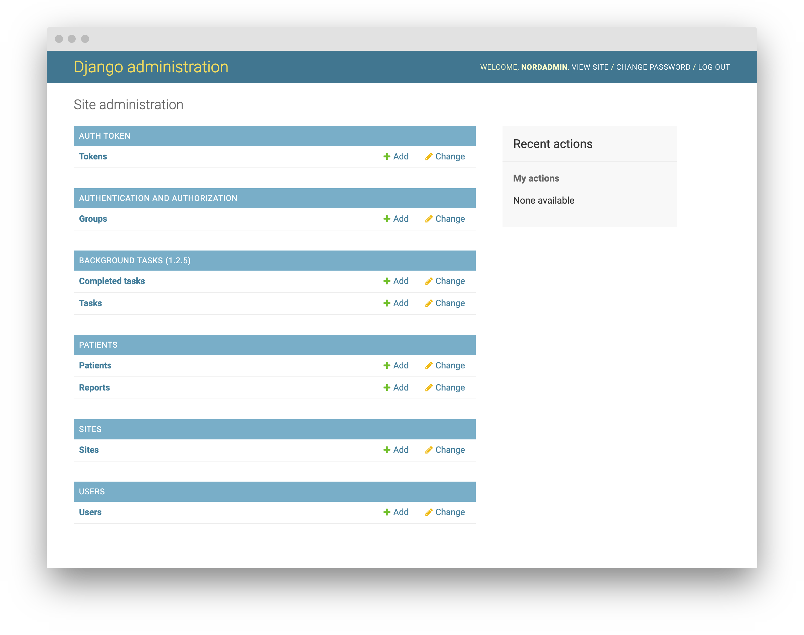

## Django Admin

The Django Admin page is an admin page built-in into django. It provides user management options and, if configurd, 
enables for managing the model instances.

<figure>
  
  <figcaption>Django Admin Dashboard</figcaption>
</figure>

## Customization

To include custom apps and their respective models in the admin page, 
a file called ``admin.py`` has to be added to the root folder of the **app**.
In our case, the app is _patients_. A file, adding the _patient_ and the _report_ model
looks like this:

```python

from django.contrib import admin
from simple_history.admin import SimpleHistoryAdmin
from .models import Patient, Report

admin.site.register(Patient)
admin.site.register(Report, SimpleHistoryAdmin)

```
