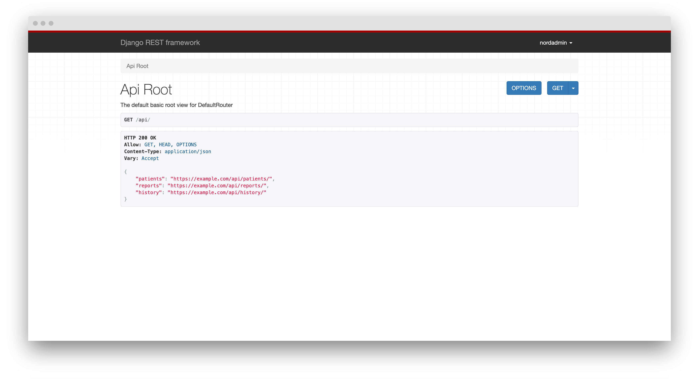
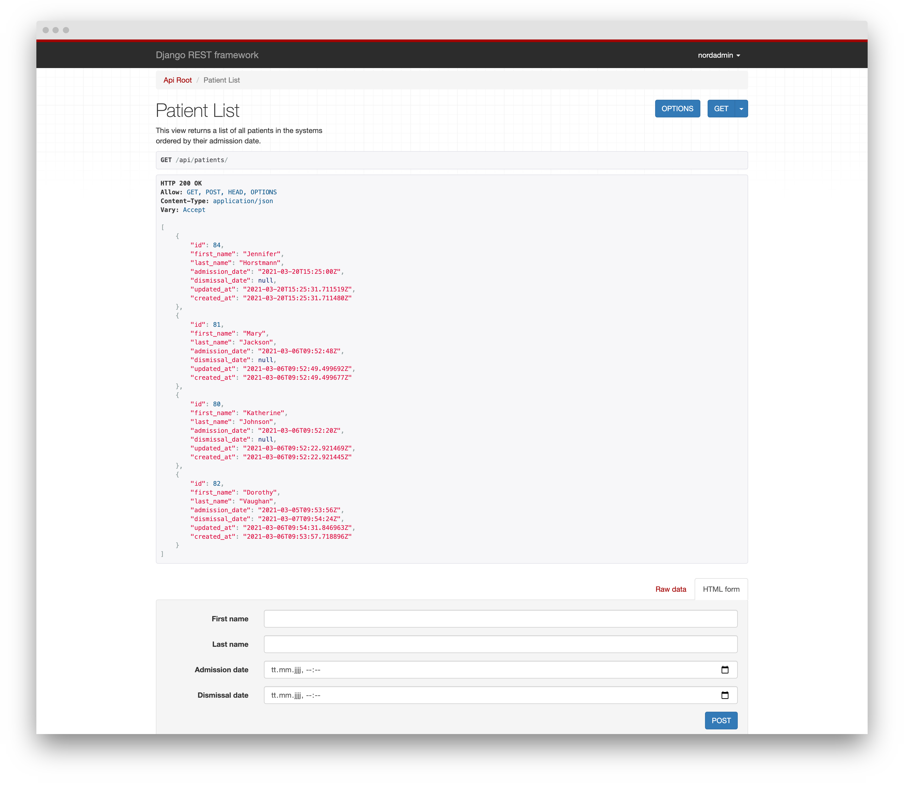
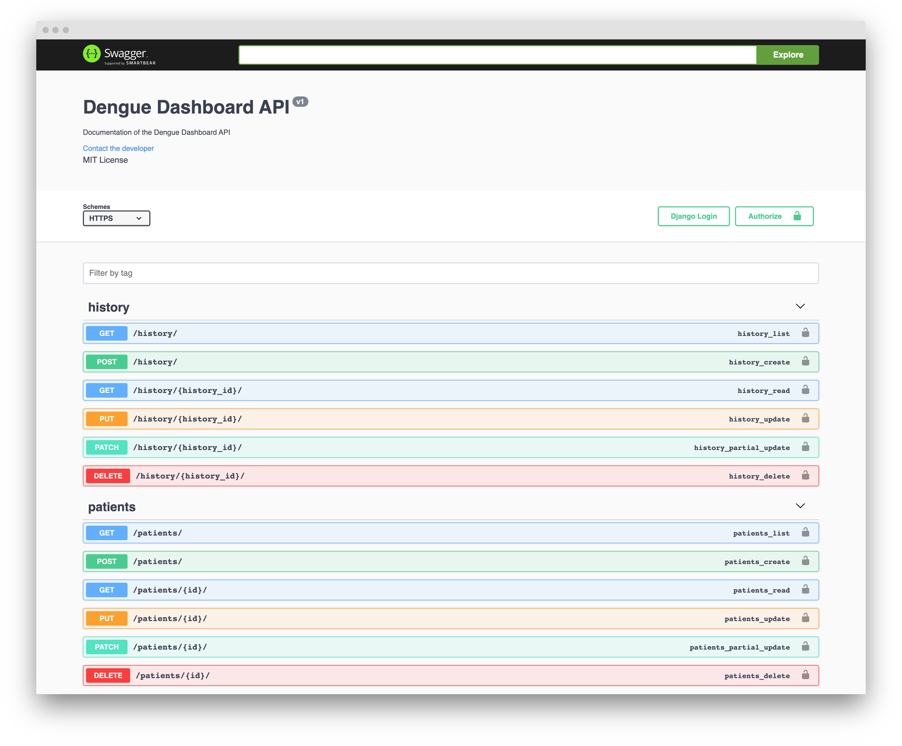
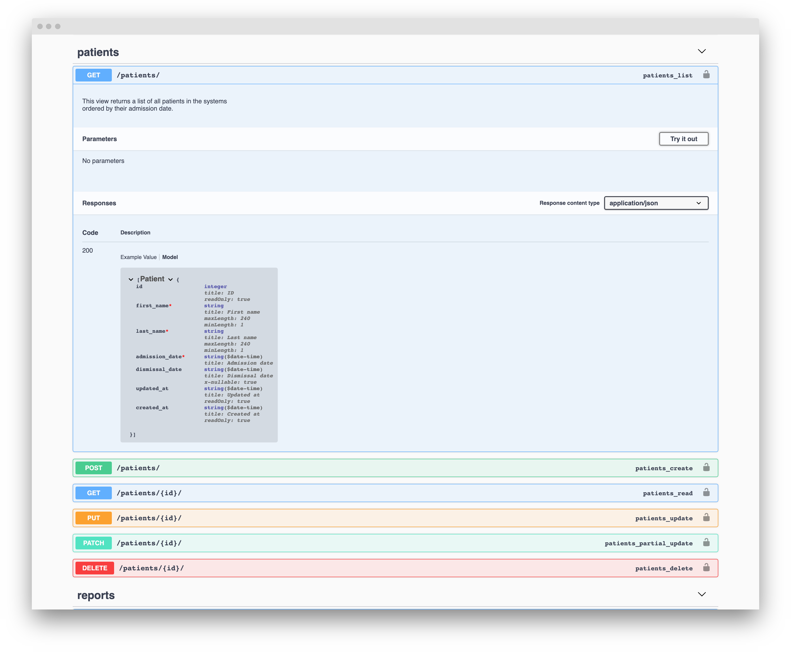
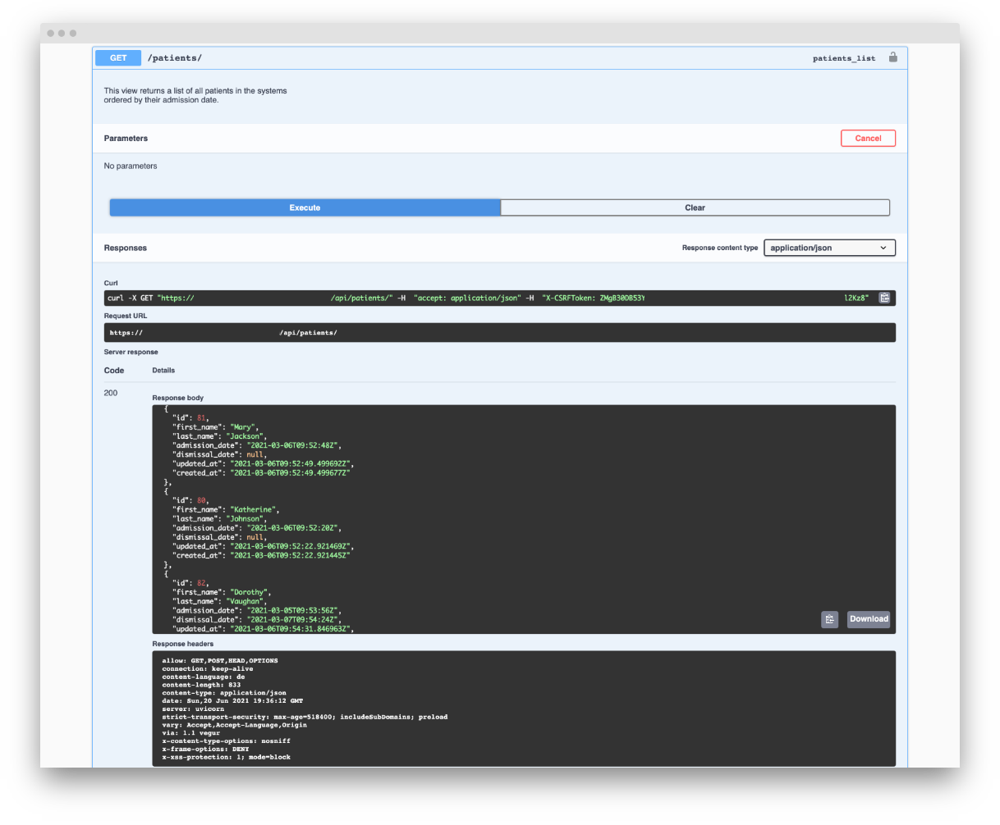
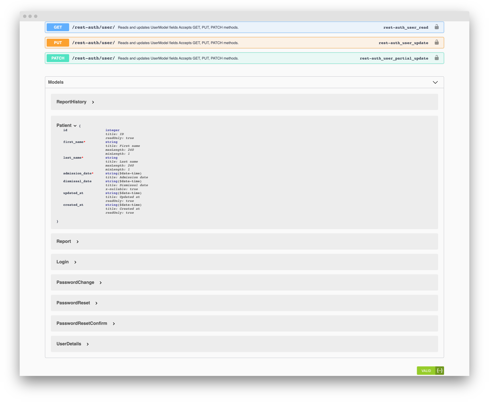

# Browsable API
The API of the project is available in form of a browsable API, where the JSON structure and meta data for
each endpoint can be obtained.

The browsable API can be found at ``/api/``

<figure>
  
  <figcaption>API root at <strong>/api/</strong> with all available endpoints</figcaption>
</figure>

<figure>
  
  <figcaption>Example of <strong>/api/patients/</strong> with HTML Form to post data.</figcaption>
</figure>

# Swagger OpenAPI Documentation
A more in-depth documentation of the API endpoints can be found at ``/swagger/``. The swagger documentation
provides a list of all endpoints of the application together with their respective REST methods (GET, POST, PUT, etc..), 
as well as a detailled model description and information on required fields and their formats. In addition to that, 
the documentation is interactive, which means that example requests can be made from within the browser. 

At the bottom of the page, swagger also provides a model documentation, which is especially useful for front end developers, who may
not have insight or knowledge about the back-end model implementations. The model documentation provides descriptions about field types, names and required fields.

<figure>
  
  <figcaption><strong>/swagger/</strong> documentation with a list of all endpoints grouped by models</figcaption>
</figure>

<figure>
  
  <figcaption>Example of <strong>/api/patients/</strong> GET endpoint with additional information.</figcaption>
</figure>

<figure>
  
  <figcaption>Example of <strong>/api/patients/</strong> GET endpoint with interactive mode (GET request and response).</figcaption>
</figure>

<figure>
  
  <figcaption>Model definition at the bottom of the API documentation.</figcaption>
</figure>