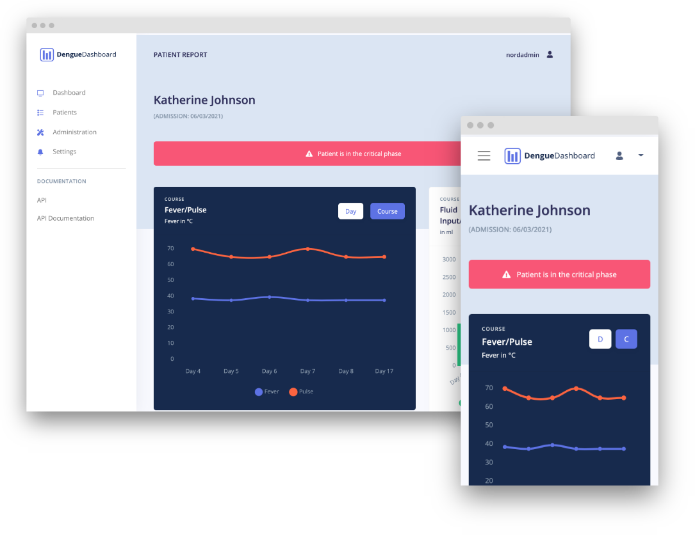

# 

The project "Dengue Dashboard" is originally a part of the Bachelor Report of Jennifer Horstmann submitted to the faculty of Mathematics and Computer Science at the University of Bremen for the degree of Bachelor of Science.

The system allows for management and visualizations of all relevant vital data for dengue fever patients as well as other parameters like the fuid balance. It is a
web app that allows multiple clients to retrieve updates and notifications in real-time and therefore supports
tele-consultation and timely interventions which are crucial in the treatment of dengue fever.

  

 